# ROS2_NEXUS_FLEET

### Kill terminals
```
pkill -f ros2
pkill -f gazebo
pkill -f gz
pkill -f rviz
pkill -f nav2
pkill -f slam_toolbox

export GZ_SIM_SYSTEM_PLUGIN_PATH=/opt/ros/$ROS_DISTRO/lib:$GZ_SIM_SYSTEM_PLUGIN_PATH
export LD_LIBRARY_PATH=/opt/ros/$ROS_DISTRO/lib:$LD_LIBRARY_PATH
```

### BUILD
```
cd ~/ros2_nexus_fleet_ws
source /opt/ros/jazzy/setup.bash
colcon build --symlink-install
source install/setup.bash
clear
```

## GOAL 1: Render model in Gazebo

### STEP 1: Creating a workspace
```
mkdir -p ~/ros2_nexus_fleet_ws/src
cd ~/ros2_nexus_fleet_ws/src
source /opt/ros/jazzy/setup.bash
ros2 pkg create fleet_description --build-type ament_cmake
```

### STEP 2: Creating folders structure
```
fleet_description/
    ├── config/
        ├── 
    ├── launch/
        ├── gazebo_rviz.launch.py
    ├── rviz/
        ├── 
    ├── urdf/
        ├── arm.xacro
        ├── car.xacro
        ├── world.xacro
    ├── worlds/
        ├── world.sdf
```
```
cd fleet_description

mkdir -p config
mkdir -p launch
mkdir -p rviz
mkdir -p urdf
mkdir -p worlds

touch launch/gazebo_rviz.launch.py
touch urdf/car.xacro
touch urdf/arm.xacro
touch urdf/world.xacro
touch worlds/world.sdf

cd ~/ros2_nexus_fleet_ws

colcon build
```

### STEP 3: Create world and render in gazebo
- Add folder config, launch, urdf, worlds, rviz, maps to CMakeLists.txt
- Add world, walls in world.sdf
- Terminal 1: gz sim -r ~/ros2_nexus_fleet_ws/src/fleet_description/worlds/world.sdf<br />
- Add gazebo node in gazebo_rviz.launch.py
- Terminal 1: ros2 launch fleet_description gazebo_rviz.launch.py


### STEP 4: Create model
- car.xacro code from **ROS2_NEXUS_ADS**, and add **${prefix}** in link name
- arm.xacro code from **ROS2_NEXUS_AGS**, and add **${prefix}** in link name
- world.xacro add a joint to attach car + arm
- Verify
```
ros2 run xacro xacro ~/ros2_nexus_fleet_ws/src/fleet_description/urdf/nexus_fleet.xacro > /tmp/test.urdf
check_urdf /tmp/test.urdf
```
- Add spawn node in gazebo_rviz.launch.py
- [BUILD](#build)
- Terminal 1: ros2 launch fleet_description gazebo_rviz.launch.py

## GOAL 2: Move model in gazebo and rviz via commands

- Remove caster wheels and add front wheels & back wheels
- Add a controller manager and define their parameters
- Remove base_link of arm , connect car_base_link to arm_shoulder_link
- Add **clock**, jsb, **load_controller**(auto activate jps, diff_drive_controller, aarm_controllerc) nodes in gazebo_rviz.launch.py
- [BUILD](#build)
- Terminal 1: ros2 launch fleet_description gazebo_rviz.launch.py
- 
- Terminal 2: ros2 control list_controllers
- Terminal 3: 
```
ros2 topic pub -r 10 /diff_drive_controller/cmd_vel geometry_msgs/msg/TwistStamped "
header:
    frame_id: car_base_link
twist:
    linear:
        x: 0.3
    angular:
        z: 0.2
"
```
- 
- Terminal 4: 
```
ros2 topic pub --once /arm_controller/joint_trajectory trajectory_msgs/msg/JointTrajectory "
joint_names:
- arm_shoulder_joint
- arm_elbow_joint
- arm_forearm_joint
- arm_wrist_pitch_joint
- arm_wrist_roll_joint
points:
- positions: [0.5, 1.0, 0.5, 0.3, 0.0]
    time_from_start: {sec: 3}
"
```
- 
- Add Spawn node with fleet.rviz
- Fixed Frame -> Odom, Add Robot Model, Add TF save config as fleet.rviz


## GOAL3: Create a map

### Step 1: LiDAR & camer Setup
- Add objects in world.sdf
- Add **gpu_lidar**, **camera** sensors and **gz-sim-sensors-system** plugin in world.xacro
- Add **/scan**, **/camera/image**, bridges in gazebo_rviz.launch.py
- [BUILD](#build)
- Terminal 1: ros2 launch fleet_description gazebo_rviz.launch.py
- Add image, topic as /camera/image and ScanLaser, topic as /scan -> save config
- 

### Step 2: Create map
- Create slam.launch.py to create map
- Add red cube for pick up
- Add blue cube for docking
- [BUILD](#build)
- Terminal 1: ros2 launch fleet_description gazebo_rviz.launch.py
- 
- Terminal 2: ros2 launch fleet_description slam.launch.py
- Terminal 3: ros2 lifecycle set /slam_toolbox configure  ros2 lifecycle set /slam_toolbox activate
- Fixed Frame -> map, Add Map, topic as /map
- 
- Terminal 4: ros2 run teleop_twist_keyboard teleop_twist_keyboard
- 
- Terminal 5: ros2 run nav2_map_server map_saver_cli -f ~/ros2_nexus_fleet_ws/src/fleet_description/maps/my_map

## GOAL 4: Localization (auto load saved map)
- Create localization.launch.py file in launch and amcl.yaml in config
- Add Map Server → loads your saved map, AMCL → localizes robot in that map, Lifecycle Manager → automatically starts them
- [BUILD](#build)
- Terminal 1: ros2 launch fleet_description gazebo_rviz.launch.py
- Terminal 2: ros2 launch fleet_description localization.launch.py
- Fixed Fram -> map
- 

## GOAL 5: Navigation - Goal Point click
- Create navigation.launch.py file in launch and nav2.yaml in config
- Add Planner → makes a path, Controller → follows the path, Behavior tree → orchestrates navigation, Recovery behaviors → unstuck logic, Velocity smoother → smooth motion, Lifecycle manager → auto-starts everything
- [BUILD](#build)
- Terminal 1: ros2 launch fleet_description gazebo_rviz.launch.py
- Terminal 2: ros2 launch fleet_description localization.launch.py
- Terminal 3: ros2 launch fleet_description navigation.launch.py
- 

## GOAL 6: AUTO NAVIGATION - To pickup point
- Create new package
```
cd ~/ros2_nexus_fleet_ws/src
source /opt/ros/jazzy/setup.bash
ros2 pkg create nexus_car_auto_nav --build-type ament_python --dependencies rclpy nav2_msgs geometry_msgs
```
```
cd ~/ros2_nexus_fleet_ws
colcon build --symlink-install
source install/setup.bash
```
- Create a node file
```
cd ~/ros2_nexus_fleet_ws/src/nexus_car_auto_nav/nexus_car_auto_nav
touch auto_nav.py
chmod +x auto_nav.py
```
- Add it to **entry_points** ```'auto_nav = nexus_car_auto_nav.auto_nav:main',```
- [BUILD](#build)
- Terminal 1: ros2 launch fleet_description gazebo_rviz.launch.py
- Terminal 2: ros2 launch fleet_description localization.launch.py
- Terminal 3: ros2 launch fleet_description navigation.launch.py
- Terminal 4: ros2 run nexus_car_auto_nav auto_nav
- 

# GOAL 7: Move Scripts folder to new package
- Terminal 1: 
```
cd ~/ros2_nexus_fleet_ws/src
ros2 pkg create nexus_controls --build-type ament_python --dependencies rclpy sensor_msgs cv_bridge geometry_msgs trajectory_msgs

cd ~/ros2_nexus_fleet_ws
colcon build
source install/setup.bash
```
```
cd ~/ros2_nexus_fleet_ws/src/nexus_controls/nexus_controls

touch drive_arm.py
touch drive_car_arm.py
touch drive_car.py

chmod +x drive_arm.py
chmod +x drive_car_arm.py
chmod +x drive_car.py
```
- Add to console_scripts ```'drive_arm = nexus_controls.drive_arm:main',```
- Add to console_scripts ```'drive_car_arm = nexus_controls.drive_car_arm:main',```
- Add to console_scripts ```'drive_car = nexus_controls.drive_car:main',```
- ros2 run nexus_controls drive_arm
- ros2 run nexus_controls drive_car_arm
- ros2 run nexus_controls drive_car

# GOAL 8: Auto Pick object

### STEP 1: Render the opencv in dock view

- Terminal 1: 
```
cd ~/ros2_nexus_fleet_ws/src
ros2 pkg create nexus_arm_auto --build-type ament_python --dependencies rclpy sensor_msgs cv_bridge geometry_msgs trajectory_msgs

cd ~/ros2_nexus_fleet_ws
colcon build
source install/setup.bash
```
```
cd ~/ros2_nexus_fleet_ws/src/nexus_arm_auto/nexus_arm_auto
touch camera_view.py
chmod +x camera_view.py
```
- Add to console_scripts ```'camera_view = nexus_arm_auto.camera_view:main',```
- 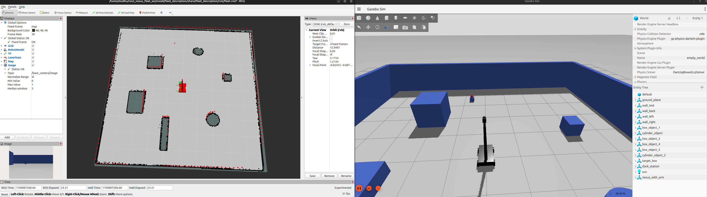
- Terminal 4: ros2 run nexus_car_auto_nav auto_nav
- 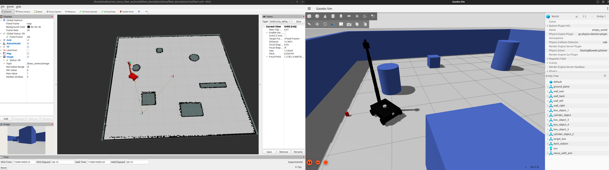
- Terminal 5: ros2 run nexus_arm_auto camera_view
- 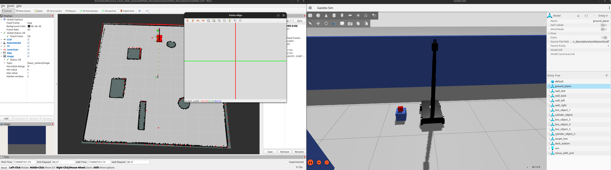

### STEP 2: Create a file auto_pick_box
```
cd ~/ros2_nexus_fleet_ws/src/nexus_arm_auto/nexus_arm_auto
touch auto_pick_box.py
chmod +x auto_pick_box.py
```
- Add to console_scripts ```'auto_pick_box = nexus_arm_auto.auto_pick_box:main',```
- Add class, write a function to see what /arm_image sees
- Add bridge, add subscription to see images, add cv2 for window
- [BUILD](#build)
- Terminal 4: ros2 run nexus_arm_auto auto_pick_box

### STEP 3: Set arm to default pose
- Declare JOINTS (all)
- create timer, import it
- We need to read joints **JointState** , send angles **JointTrajectoryPoint**
- Define all points to **0.0**, declare a variable
- Create a common function to send poses
- Terminal 4: ros2 run nexus_arm_auto auto_pick_box
- 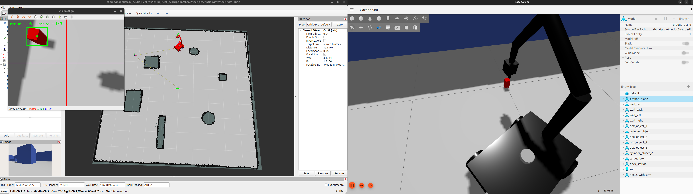

### STEP 4: Find Box
```
We are going to find the box first. How?
1. While rotating, search for object, it will enter
2. We need to know that is inside the window, so - inside opencvwindow, we will put another window
3. There will be gap between inner and outerwindow, this will be our loop hole
4. First it enters that gap - box_entered, then while rotating - box exits the gap - now box is inside the opencvwindow
```
- Pre defined points on ground
- 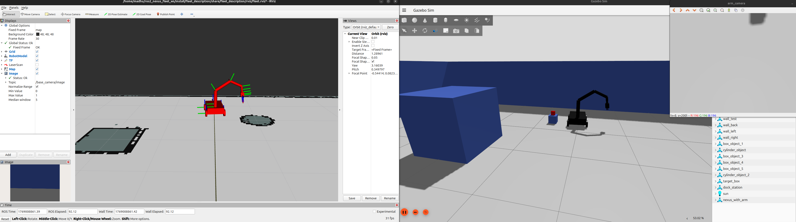
- In OpenCV Window draw a rectangle with text **X -X Y -Y**
- Rotate only shoulder using max and min **3.14, -3.14**, with step **0.1**, direction 1(this will change when it reaches max or min)
- 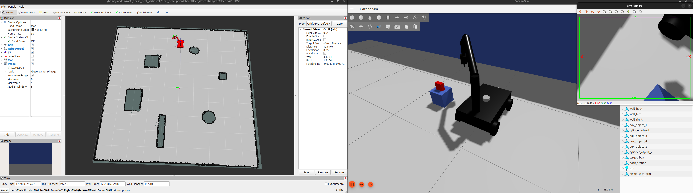
- Terminal 4: ros2 run nexus_arm_auto auto_pick_box
- 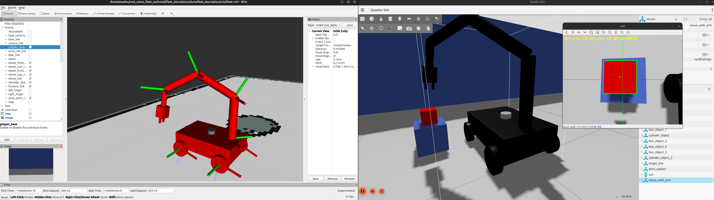

### STEP 5: Align Wrist
- write a align_wrist_roll_rotate func for rotating wrist
- Write a open_grippers func to open grippers
- Define wrist, fingers params, (max, min, step, direction)
- Form a green border around box, remove border lines, and put co-ordinate axis - **X - Y Lines**
- To align wrist, we use err_r, we use angle diff from cv2 contours
- 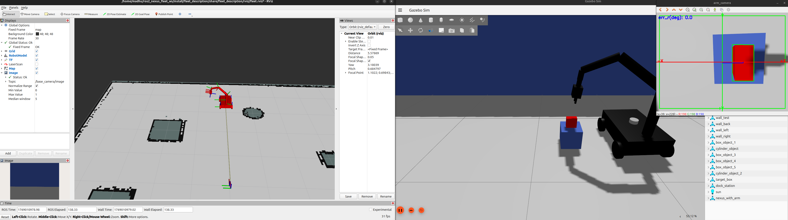

### STEP 6: Align X - AXIS
- Find err_y from **cx - (w // 2)**
```
center of box to center of width of opencvwindow
```
- We use P from PID, we change direction if error get bigger, if error get smaller, we change speed of it
- 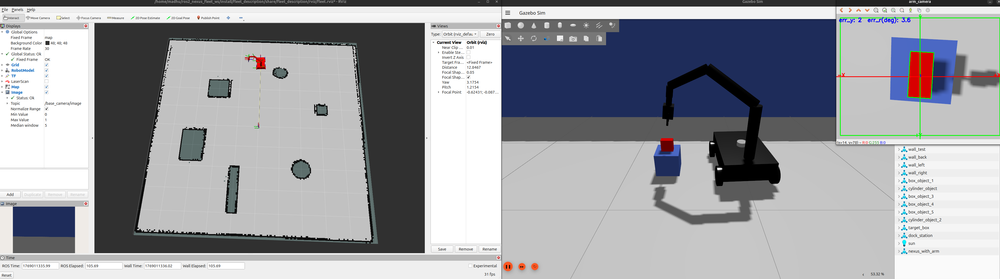

### STEP 7: Align Y - AXIS
- Find err_x from **cy - (h // 2)**
```
center of box to center of height of opencvwindow
```
- We use P from PID, we change direction if error get bigger, if error get smaller, we change speed of it
- 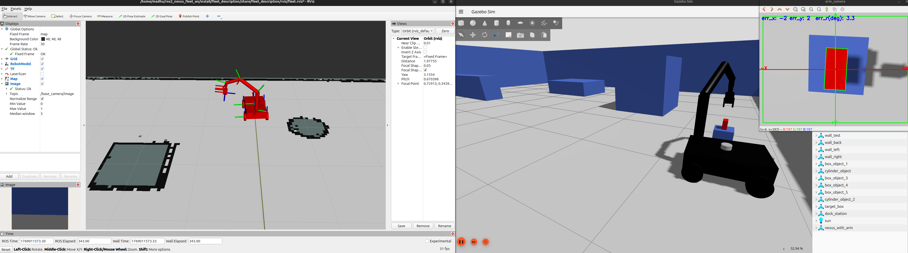

### STEP 8: Align Z - AXIS
- write a align_elbox_zaxis func for aligning all axis
- We move elbow in same direction, till red box again goes into gap_between
- Then we stop
- 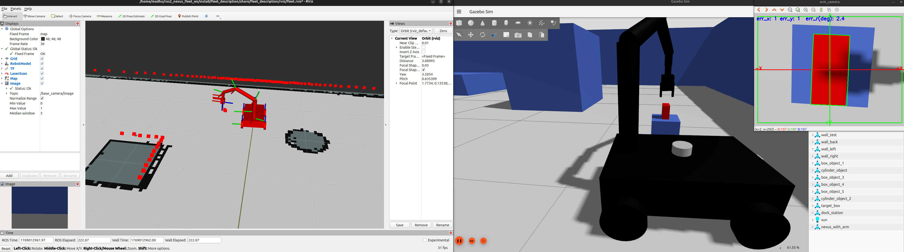

### STEP 9: Positioning - Align X Y Z axis
- Now we move elbow + forarm
- Elbow moves in same direction and forearm in opposite direction
- 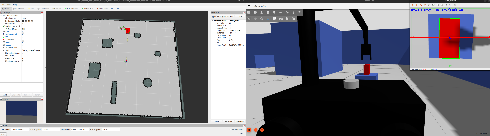
- We call gripper to hold
- 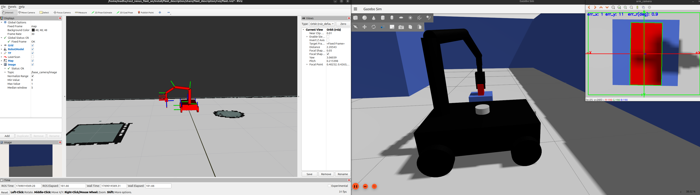

### STEP 10: PICK UP
- 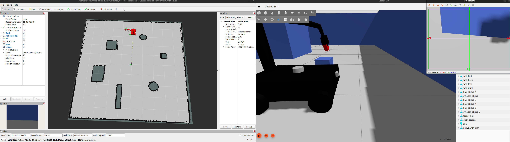
- 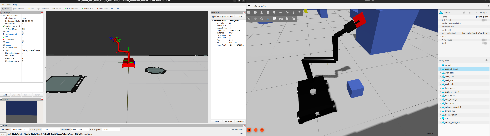
- 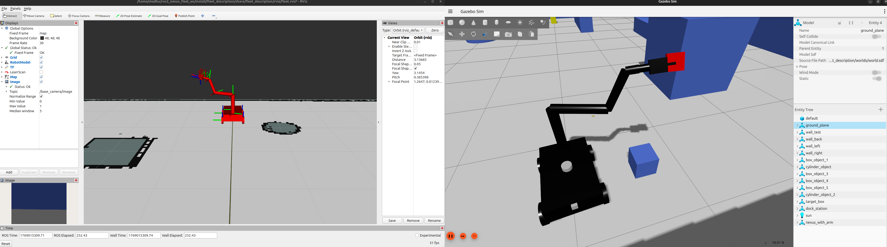