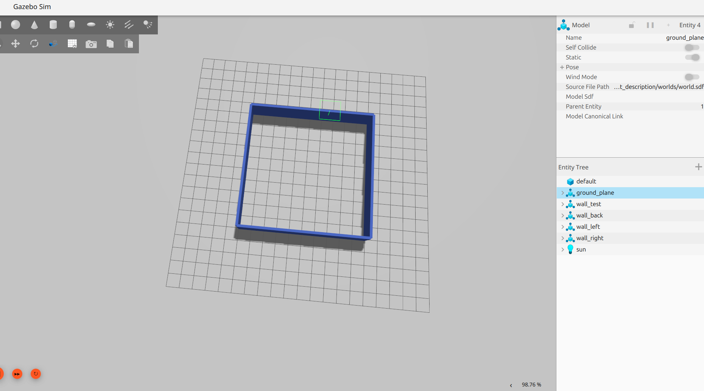
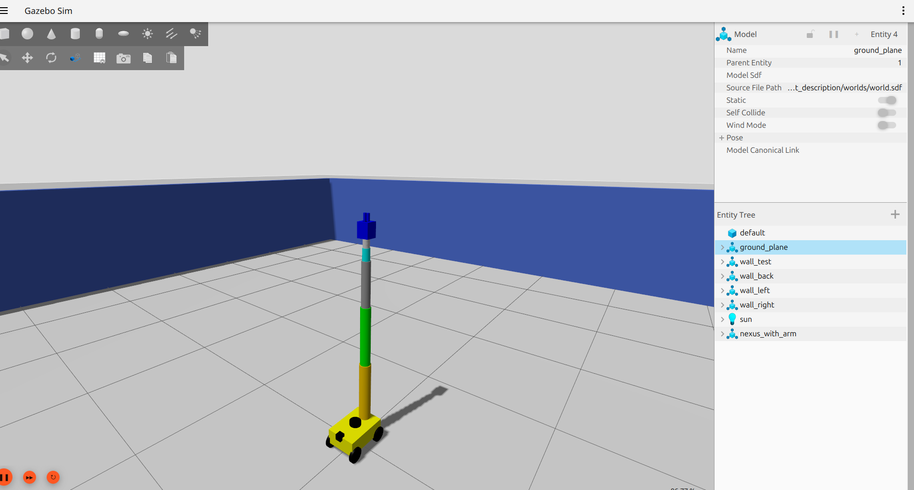
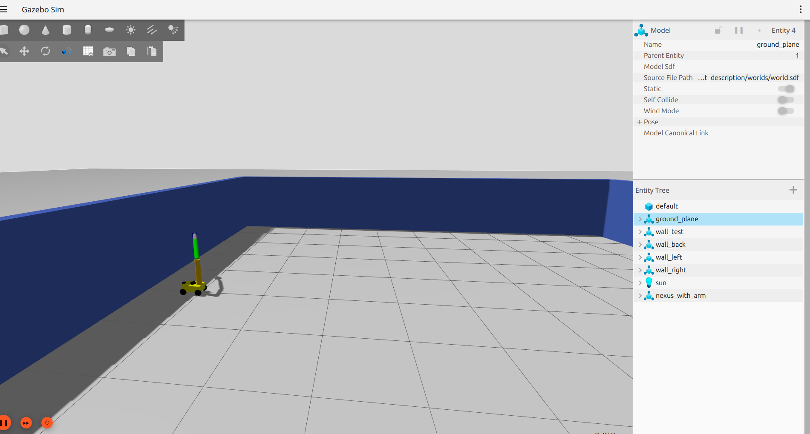
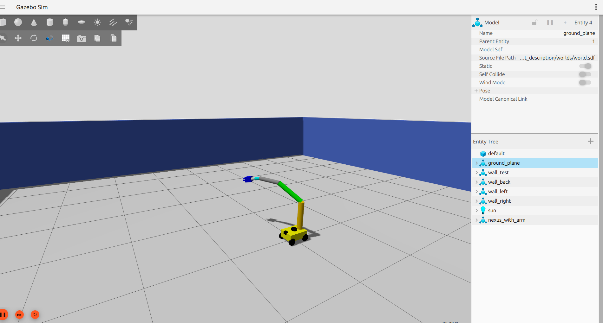
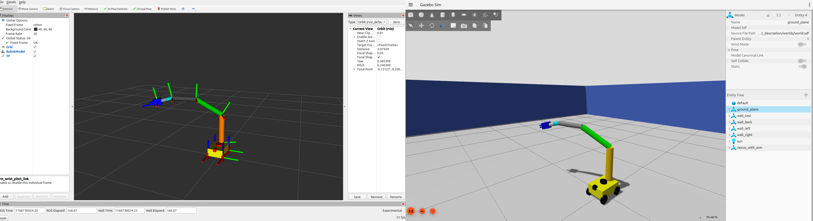

# ROS2_NEXUS_FLEET

### Kill terminals
```
pkill -f ros2
pkill -f gazebo
pkill -f gz
pkill -f rviz
pkill -f nav2
pkill -f slam_toolbox
```

### BUILD
```
cd ~/ros2_nexus_fleet_ws
source /opt/ros/jazzy/setup.bash
colcon build --symlink-install
source install/setup.bash
clear
```

## GOAL 1: Render model in Gazebo

### STEP 1: Creating a workspace
```
mkdir -p ~/ros2_nexus_fleet_ws/src
cd ~/ros2_nexus_fleet_ws/src
source /opt/ros/jazzy/setup.bash
ros2 pkg create fleet_description --build-type ament_cmake
```

### STEP 2: Creating folders structure
```
fleet_description/
    ├── config/
        ├── 
    ├── launch/
        ├── gazebo_rviz.launch.py
    ├── rviz/
        ├── 
    ├── urdf/
        ├── arm.xacro
        ├── car.xacro
        ├── world.xacro
    ├── worlds/
        ├── world.sdf
```
```
cd fleet_description

mkdir -p config
mkdir -p launch
mkdir -p rviz
mkdir -p urdf
mkdir -p worlds

touch launch/gazebo_rviz.launch.py
touch urdf/car.xacro
touch urdf/arm.xacro
touch urdf/world.xacro
touch worlds/world.sdf

cd ~/ros2_nexus_fleet_ws

colcon build
```

### STEP 3: Create world and render in gazebo
- Add folder config, launch, urdf, worlds, rviz, maps to CMakeLists.txt
- Add world, walls in world.sdf
- Terminal 1: gz sim -r ~/ros2_nexus_fleet_ws/src/fleet_description/worlds/world.sdf<br />
- Add gazebo node in gazebo_rviz.launch.py
- Terminal 1: ros2 launch fleet_description gazebo_rviz.launch.py



### STEP 4: Create model
- car.xacro code from **ROS2_NEXUS_ADS**, and add **${prefix}** in link name
- arm.xacro code from **ROS2_NEXUS_AGS**, and add **${prefix}** in link name
- world.xacro add a joint to attach car + arm
- Verify
```
ros2 run xacro xacro ~/ros2_nexus_fleet_ws/src/fleet_description/urdf/world.xacro > /tmp/test.urdf
check_urdf /tmp/test.urdf
```
- Add spawn node in gazebo_rviz.launch.py
- [BUILD](#build)
- Terminal 1: ros2 launch fleet_description gazebo_rviz.launch.py

## GOAL 2: Move model in gazebo and rviz via commands

- Remove caster wheels and add front wheels & back wheels
- Add a controller manager and define their parameters
- Remove base_link of arm , connect car_base_link to arm_shoulder_link
- Add **clock**, jsb, **load_controller**(auto activate jps, diff_drive_controller, aarm_controllerc) nodes in gazebo_rviz.launch.py
- [BUILD](#build)
- Terminal 1: ros2 launch fleet_description gazebo_rviz.launch.py
- 
- Terminal 2: ros2 control list_controllers
- Terminal 3: 
```
ros2 topic pub -r 10 /diff_drive_controller/cmd_vel geometry_msgs/msg/TwistStamped "
header:
    frame_id: car_base_link
twist:
    linear:
        x: 0.3
    angular:
        z: 0.2
"
```
- 
- Terminal 4: 
```
ros2 topic pub --once /arm_controller/joint_trajectory trajectory_msgs/msg/JointTrajectory "
joint_names:
- arm_shoulder_joint
- arm_elbow_joint
- arm_forearm_joint
- arm_wrist_pitch_joint
- arm_wrist_roll_joint
points:
- positions: [0.5, 1.0, 0.5, 0.3, 0.0]
    time_from_start: {sec: 3}
"
```
- 
- Add Spawn node with fleet.rviz
- Fixed Frame -> Odom, Add Robot Model, Add TF save config as fleet.rviz

